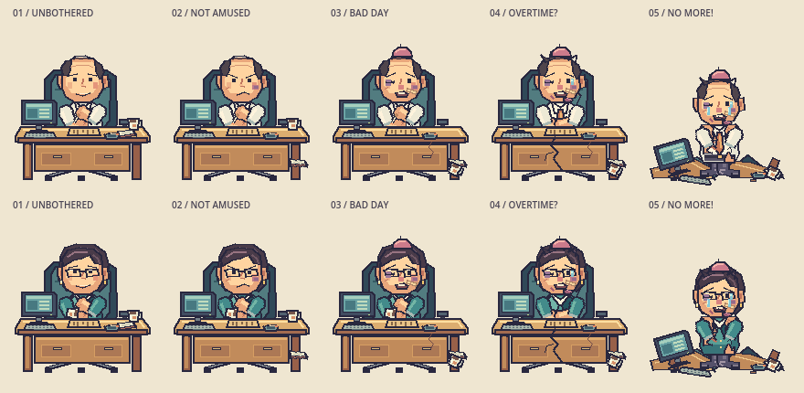
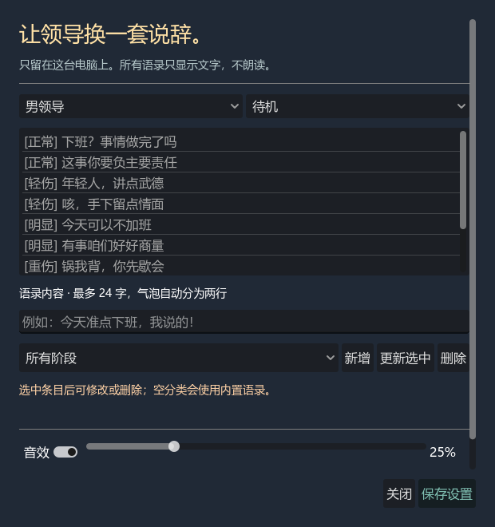
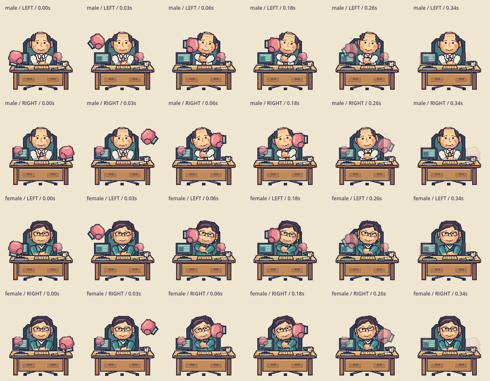
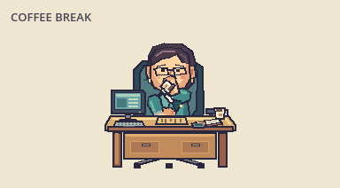
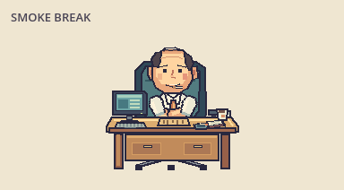

# Windows 桌宠验收记录

验收时间：2026-09-12 至 2026-09-16。实现规格：`.scratch/desktop-pet/spec.md`。

## 环境

- Windows 11 25H2，构建 26200.9168，x64。
- Godot 4.5.2 stable（6ce3de25a），Compatibility / OpenGL 3.3。
- NVIDIA GeForce RTX 5060，驱动 616.64。
- 单显示器；Godot 报告工作区 `(0, 0, 2560, 1392)`、DPI 96、缩放 1.0。
- 桌宠三档物理窗口尺寸：192×212、288×318、384×424。原生穿透 DLL 使用静态 C++ 运行库。

## 自动化与渲染验收

| 检查 | 结果与覆盖范围 |
| --- | --- |
| `test_core.gd` | 受击、暴击保底、队列上限、阶段跨越、36 点封顶、单次终态、双角色独立状态、切换/重置取消、气泡节奏、配置与语录校验/读写/损坏恢复 |
| `test_desktop.gd` | 负坐标多屏几何、离屏恢复、设置草稿增删改/验证/恢复默认、保存按钮可见、四种不同的合成音效 |
| `test_view.gd` | 家具和前景道具遮挡不能击中人物；透明处不能命中 |
| `test_app.gd` | 真实场景和渲染器；两角色两武器完整流程、一次性终态、重置、三档缩放、置顶、设置保存/重载、隐藏/恢复和原生窗口标记；快速拖动事件坐标回归 |
| `native/test_native.gd` | 无效句柄拒绝、真实 HWND 开关穿透、重复调用、Variant 与 ptrcall 两条调用路径 |

9 月 16 日的真实场景与原生测试均通过，退出码为 0，无脚本/平台错误。核心、桌面和视图测试由最终构建脚本再次执行并要求成功标记；构建同时检查资源导入和导出错误。

美术和设置截图直接来自 Godot 渲染器，不包含用户桌面内容：

## 真实 Windows 输入验收

- 透明背景：先前导出启动检查中，窗口四角与底层桌面像素一致，人物/家具保持可见。
- 跨进程穿透：9 月 14 日使用独立 Python/Tk 点击接收器。点击主窗口透明边缘和可见气泡均使底层应用计数加一，未触发攻击。原先仅依赖 Godot `mouse_passthrough` 的实现会吞掉这些点击；已改用原生窗口样式，见 ADR 0002。
- 真实人物点击：9 月 16 日一次点击产生恰好一个普通拳套攻击事件，进度从 0 到 1。
- 快速拖动：同日从窗口内 `(95, 75)` 拖到 `(120, 90)`，窗口从 `(950, 690)` 移到 `(975, 705)`，配置保存同一位置，攻击日志保持为空。修复前回归测试失败；修复后自动测试及实机输入均通过。
- 正常关闭测试窗口成功，未遗留测试进程。先前导出版关闭已验证可生成包含 46 条语录的有效便携配置。

## 已修复的审查问题

- 首次启动缺失配置误报、损坏配置恢复和原文件备份。
- 受拥有窗口不能自行置顶导致的 Windows 平台错误。
- 前景道具误击中人物、终态跪姿被家具遮挡、设置保存按钮越界。
- 通用自定义语录被各阶段默认语录完全排除；现在通用条目与匹配阶段条目一起参与选择。
- 快速拖动按下事件使用过晚的系统鼠标坐标；现在使用按下事件自带位置。

## 最终便携包

初版运行 `tools/build.ps1` 成功。初版 ZIP 大小 34,963,351 字节，顶层仅包含 `DesktopPet.exe`、`windows_mouse_passthrough.dll`、`README.md` 和 `THIRD_PARTY_NOTICES.md`。后续 0.1.1 排除了资源包内的 `dist` 目录，见下文。

SHA256：`A0BD3F86A907D044ACB9F864ED80A136EB949FB48060C3862D92E946C94E1893`。

从新建目录解压并实际启动，首屏为完整男领导，192×212 透明窗口；右键菜单正常出现。正常关闭后生成版本 1、46 条语录的 `preferences.json`，进程退出。启动日志仅包含引擎和显卡信息，无错误。

## 0.1.1：头身连接与勾拳修复

- 头部下移 7 像素，让下巴连接点落在衣领内；拳套受击不再向上平移头部。两角色、五阶段、普通与暴击的各个采样时刻均用透明像素判定验证连接。
- 左右拳采用镜像弧线与逐渐转向的拳面，命中时拳面朝内，另一只拳套在对侧防守；命中后有实际收拳位移。普通攻击仍为 0.35 秒，命中停留仍为 0.15 秒。
- 回归测试先复现头部断开与 9 项勾拳错误，修复后视图测试通过；核心、桌面和真实场景测试也通过。以下逐帧图由 Godot 实际渲染生成。

用户正在运行初版，未关闭其程序。新程序单独输出到 `dist/DesktopPet-0.1.1/`，新包为 `dist/DesktopPet-Windows-x64-0.1.1.zip`，通用 ZIP 也已更新。重新解压启动通过，版本号 0.1.1.0，无脚本或平台错误。导出排除 `dist/*`，并检查导出日志没有打包该目录中的配置。

新包大小：34,964,181 字节。SHA256：`774A28A5B0E5AC42AC36EB5279E86EA3F4FF279E20EE87C85290937B4F7AEBDB`。

## 0.1.2：下巴受伤与自动恢复

- 原下巴效果是 26×13 的粉色横条，覆盖整个脖子。现改为 12×8 的单侧下颌淤青，并通过贴图尺寸、位置和实际渲染图检查。
- 首次达到 36 点后播放 1.2 秒散架动画，再保持跪姿 5 秒；随后仅恢复当前领导，另一位领导的独立进度保持不变。恢复事件会立即刷新人物、桌椅、局部伤势和气泡。
- 回归测试在修复前稳定复现“保持 36 点不恢复”“没有界面恢复事件”和“下巴横条过宽”三项错误。修复后核心、视图和真实场景测试通过。
- 0.1.2 便携包只含 EXE、原生 DLL、README 和许可声明；从全新目录启动退出码为 0，文件与产品版本均为 0.1.2.0。ZIP 大小 34,964,913 字节，SHA256 为 `155F364A967F577E79BE5BD48D64194465B14A93649B1742AC33BCBC2DDCBE2D`。

## 0.1.3：喝咖啡与对话气泡

- 女性角色抬杯最高点的杯心从距嘴 12 像素调整到不超过 8 像素，右臂与前臂置于头部前层，避免脸遮住手和杯子。
- 对话气泡改为锚定可见头顶：底边与头顶的间距从约 37 像素缩至最多 6 像素。位置仍随 1×、1.5×、2× 缩放，并继续使用独立的鼠标穿透窗口。

0.1.3 便携包从全新目录启动退出码为 0，文件与产品版本均为 0.1.3.0。ZIP 大小 34,965,262 字节，SHA256 为 `CC141D2E145606D9150F7D37ACC32779258CB3EB3466E603B8FEF289E1476819`。

## 0.1.4：抽烟位置

- 男角色的烟不再复用女角色的举杯位移；它固定在嘴边，烟雾从同一贴图的烟头坐标升起。
- 女性角色仍使用右手端杯。视图测试覆盖两个角色的不同父节点与男角色烟头到嘴边的距离。

0.1.4 便携包从全新目录启动退出码为 0，文件与产品版本均为 0.1.4.0。ZIP 大小 34,965,652 字节，SHA256 为 `056814DA2AB5CF7A3D8C500DB67BF45C6AE8676DCCF49EEC23E6DC54C6C61381`。

## 0.1.5：启动无闪窗

- 根因是 Godot 默认启动图、192×212 主窗口在场景就绪前已经可见，以及 `_ready()` 主动显示的首次引导气泡。现在启动阶段使用透明 1×1 窗口，关闭启动图；场景完成一帧绘制后再恢复配置的尺寸和位置，并移除启动引导气泡。
- `tests/test_startup_windows.ps1` 对实际导出 EXE 采样窗口内容和屏幕像素。旧行为稳定命中中央未完成首帧与 196×56 引导框；修复后仅观察到无像素变化的透明占位句柄和最终 192×212 桌宠窗口，测试通过。

0.1.5 便携包从全新目录构建并通过启动探针，文件与产品版本为 0.1.5.0。ZIP 大小 34,965,636 字节，SHA256 为 `69E758E5D09BA822FA4D0647C6DE48ABF85C320DD9064111554F6476A7EC17B3`。

## 验收边界

Windows 10、其他显卡、多显示器实机拖动和混合 DPI 未验收。负坐标及显示器断开回收位置只有几何自动测试；不能据此声称完成多屏硬件兼容验证。音效生成和差异已有测试，未将实际听感作为自动化通过项。便携版未进行代码签名。
